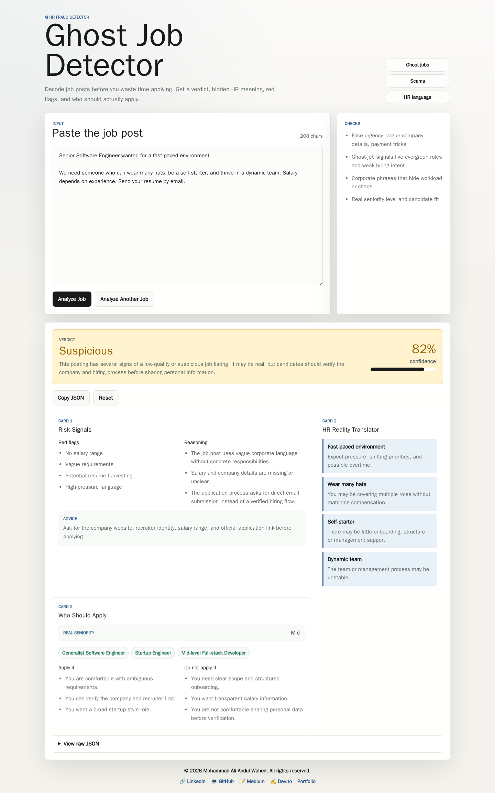

# Ghost Job Detector

## ⚠️ Why This Project Exists

Most job posts today are unclear, exaggerated, or completely misleading.

Candidates often waste hours applying to roles that are:
- not actively hiring
- poorly defined
- designed to collect applications without real intent

Ghost Job Detector uses AI to decode job posts and reveal what companies actually mean behind corporate language.

---

## 🧠 What I Built

Ghost Job Detector is a web app that analyzes job descriptions and classifies them as:

- Legit
- Ghost Job
- Scam
- Suspicious

But it goes beyond classification.

It explains WHY a job post is risky, translates corporate HR language into real meaning, and estimates who should actually apply.

---

## 🚀 Live Demo

https://ghost-job-detector-rlcx.vercel.app/
---

## 🎯 Key Features

- AI-powered job post classification
- Ghost job detection
- HR language translation into real meaning
- Candidate fit analysis
- Confidence scoring
- Structured JSON reasoning output
- Real-time fallback model system
- Fully responsive UI

---

## 🧩 How It Works

1. Paste a job description
2. Click Analyze
3. AI returns:
   - Verdict (legit / ghost / scam / suspicious)
   - Reasons
   - Red flags
   - HR translation
   - Who should apply

---

## 🧠 HR Reality Layer

The AI translates corporate phrases like:

- "Fast-paced environment" → Expect overwork and pressure
- "Wear many hats" → Multiple roles without proper compensation
- "Self-starter required" → Little guidance or onboarding

---

## 🤖 How I Used Gemma 4

This project uses Google Gemma 4 as the reasoning engine:

- `google/gemma-4-26b-a4b-it:free` (primary model)
- `google/gemma-4-31b-it:free` (fallback model)

Gemma is responsible for:
- interpreting job descriptions
- detecting deception signals
- translating HR language
- generating structured JSON output

---

## 🧠 Technical Insight

The system enforces strict JSON output to ensure:
- consistent UI rendering
- safe parsing
- predictable AI behavior
- reliable fallback handling

---

## 📸 Screenshots

### Job Analysis Result


---

## 💡 Impact

This tool helps job seekers avoid wasting time on misleading job posts and improves decision-making before applying.

---

## 🛠 Tech Stack

- Next.js
- TypeScript
- Vanilla CSS
- OpenRouter API
- Gemma 4 Models
- Vercel Deployment

- Docker for optional local containerized runs
- Vercel-ready deployment

## AI Models

The app uses OpenRouter with Gemma models only.

Primary model:

```text
google/gemma-4-26b-a4b-it:free
```

Fallback order:

```text
google/gemma-4-26b-a4b-it:free
google/gemma-4-31b-it:free
```

If a model is rate-limited or fails, the API silently retries once after 2 seconds, then moves to the next Gemma 4 model. If all Gemma 4 models fail, the user sees a clean busy message.

## Environment Variables

Create `.env.local` for local development:

```bash
OPENROUTER_KEY=sk-or-v1-your-key-here
```

For Vercel, add the same variable in:

```text
Project Settings > Environment Variables
```

Never commit `.env.local`.

## Run Locally Without Docker

Install dependencies:

```bash
npm install
```

Start the dev server:

```bash
npm run dev
```

Open:

```text
http://localhost:3000
```

Production build:

```bash
npm run build
npm run start
```

## Run Locally With Docker

Build the image:

```bash
docker build -t ghost-job-detector .
```

Run using `.env.local`:

```bash
docker run --rm -p 3000:3000 --env-file .env.local ghost-job-detector
```

Run by passing the key directly:

```bash
docker run --rm -p 3000:3000 -e OPENROUTER_KEY=sk-or-v1-your-key-here ghost-job-detector
```

Open:

```text
http://localhost:3000
```

## Docker Compose

PowerShell:

```powershell
$env:OPENROUTER_KEY="sk-or-v1-your-key-here"
docker compose up --build
```

Bash:

```bash
OPENROUTER_KEY=sk-or-v1-your-key-here docker compose up --build
```

Stop Docker Compose:

```bash
docker compose down
```

## Restart Local Docker App

If an old container is already using port `3000`, check running containers:

```bash
docker ps
```

Stop the current app container:

```bash
docker stop ghost-job-detector-live
```

Rebuild and run the latest code:

```bash
docker build -t ghost-job-detector .
docker run --rm -d --name ghost-job-detector-live -p 3000:3000 --env-file .env.local ghost-job-detector
```

View logs:

```bash
docker logs -f ghost-job-detector-live
```

Stop it:

```bash
docker stop ghost-job-detector-live
```

## Pull Latest Changes

Then rebuild and restart Docker:

```bash
docker stop ghost-job-detector-live
docker build -t ghost-job-detector .
docker run --rm -d --name ghost-job-detector-live -p 3000:3000 --env-file .env.local ghost-job-detector
```

## 
---

## 📌 Note

This project is part of the Gemma 4 Challenge submission.